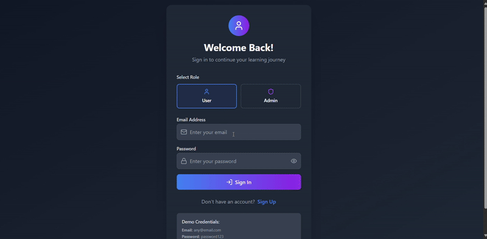

<h1 align="center">🚀 Dev_Elevate </h1>


<div align="center">
  <br><br>
  
  <p align="center">
  <b>This project is now OFFICIALLY accepted for: ❄ Code Social ❄ </b> <br><br>
  <b>❄ Cognise. Connect. Cultivate. Code Social. ❄ 🚀💃🎉💻 </b>  
</p>
</div>


<p align="center">
  
</p>

**DevElevate is a full-stack, AI-powered smart education and career advancement platform built to empower students, developers, and job seekers. It centralizes learning resources, personalized roadmaps, job updates, resume tools, and much more — all in one powerful dashboard.**

<!--- Welcome back, Developer! 👋 Ready to continue your learning journey? -->


<div align="center">
  
</div>

**Your Personalized Smart Learning & Placement Hub**

**_Frontend is fully working_**
**_Backend is fully working_**
**_Google Authentication is fully working_**

**_🚧 Important Note: Before you start working, check the GitHub repository branch._**
**_🔄 First: Sync (pull) to the latest merged code from the main branch._**
**_✅ Then: Start working on your assigned issue or feature._**


**_⚠ Skipping this step can cause merge conflicts and your PR may be rejected._**

**_🚧 Important Note: login, registration, or Google authentication system Everything is working properly._**

**_⚠ Do NOT remove or change any existing code unrelated to your issue! If your PR modifies or deletes any core code without a valid reason, it will not be merged._**

**_🚫 Strict Rule: Do NOT bypass the login, registration, or Google authentication system. If any such activity is found, you will be removed and reported from this project._**

---

> ⚠️ **IMPORTANT WARNING:**  
> 💡 **Before pushing your changes, make sure to _switch to the correct branch_ first!** 🪄  
>  
> 🔴 **Commands to Follow:**  
> ```bash
> git checkout <branch-name>    # 🔁 Switch to your assigned branch
> git pull origin <branch-name> # ⬇️ Pull latest updates
> git add .                     # ➕ Add your changes
> git commit -m "your message"  # 💬 Commit with a clear message
> git push origin <branch-name> # 🚀 Push your code safely
> ```
> 🧠 **Tip:** Always double-check the branch before pushing to avoid merge conflicts! ⚡  

---


**📊 Project Insights**

<table align="center">
  <thead align="center">
    <tr>
      <td><b>🌟 Stars</b></td>
      <td><b>🍴 Forks</b></td>
      <td><b>🐛 Issues</b></td>
      <td><b>🔔 Open PRs</b></td>
      <td><b>🔕 Closed PRs</b></td>
      <td><b>🛠️ Languages</b></td>
      <td><b>👥 Contributors</b></td>
      <td><b>📦 Repo Size</b></td>
      <td><b>🕒 Last Commit</b></td>
      <td><b>📈 Commit Activity</b></td>
    </tr>
  </thead>
  <tbody>
    <tr>
      <td></td>
      <td></td>
      <td></td>
      <td></td>
      <td></td>
      <td></td>
      <td></td>
      <td></td>
      <td></td>
      <td></td>
    </tr>
  </tbody>
</table>


---

<h2 align="center">🎯 Open Source Programmes ⭐</h2>

<p align="center">
  <b>This project is now OFFICIALLY accepted for: Code Social </b>
</p>

🌟 **Exciting News...**

### Cognise. Connect. Cultivate. Code Social.🚀💃🎉💻

🚀💃🎉💻 We’re beyond excited to welcome passionate contributors from across India and around the world 🌍 to collaborate, innovate, and grow with **DevElevate** — an open-source platform built to make learning, development, and career growth smarter, faster, and community-driven. 🌟👨‍💻👩‍💻  

👩‍💻 **DevElevate** is India’s next-generation open-source movement that empowers developers, designers, and innovators of all experience levels to contribute to real-world solutions 🌐 while gaining hands-on experience, personalized mentorship, and global exposure. 🌱  

💡 Here, open source meets intelligence — blending **AI, community, and creativity** to redefine how people learn, build, and grow together. Whether it’s solving real challenges, contributing to meaningful projects, or exploring futuristic tech, **DevElevate** is your launchpad to innovation. 🚀  

🌈 With **dedicated mentors**, **vibrant community support**, and **collaborative coding opportunities**, this platform creates a powerful ecosystem for developers to:  

✨ Master modern tech stacks (Full Stack, AI/ML, Cloud, DevOps, and more)  
🤝 Contribute to impactful, scalable, and production-level projects  
🧠 Learn the principles of teamwork, leadership, and clean coding  
🎯 Participate in hackathons, open-source programs & live project sprints  
🏆 Gain global recognition, certificates, and exclusive DevElevate swag  
📚 Get personalized learning recommendations and resume-building support  
💬 Network with peers, mentors, and organizations across the world  
⚡ Sharpen technical, creative, and problem-solving skills through collaboration  

🌍 **DevElevate isn’t just a project — it’s a movement.**  
A movement that unites passionate minds to code for impact, share knowledge, and shape the future of technology together. 💫  

🎉 Whether you’re a beginner contributing your first line of code or a seasoned developer mentoring others, there’s a place for everyone here.  

❤️ **We’re thrilled to have you join the DevElevate family — where innovation meets opportunity, and ideas turn into impact.**  
Let’s code, collaborate, and create the future — one smart commit at a time. 🔥👨‍💻👩‍💻🌟


## 🔁 Project Flowchart (DevElevate Platform)


## 🔁 Project ER Diagram (DevElevate Platform)


## 📘 Project Documentation

We’ve documented everything in detail including architecture, API structure, database models, UI flows, and more.  
Click the link below to explore the complete guide:

[📄 View Full DevElevate Documentation (Google Docs)](https://docs.google.com/document/d/1oHgo5GmPDQu6eV9ND3VrYcpi0Dwvb-wWZi-lMgjFAH8/edit?usp=sharing)

---

📊 [View Contributor Performance Sheet (Google Sheets)](https://docs.google.com/spreadsheets/d/1n2JGcKr0ZJzqeHZBciVKB50kiI3bp65cj-QM7gfqdnY/edit?usp=sharing)


> ⚠️ **📢 Important Note – Must Read Before You Contribute!** ⚠️


<!-- New Login Flow GIF -->



### 🔐 **Login / Sign Up Now Live!**

🚀 The **Login/Sign Up** flow is now fully integrated and appears first for both:

- 👤 **Users**
- 🛡️ **Admins**
---

### 🔑 Admin Credentials
### Email: officialdevelevate@gmail.com
### Password: Develevate@2025

---

### ✅ **What Works:**

- 🔄 You can now **register and log in** using role-based access.
- 🧭 Full **navigation** and **role-based dashboards** are active.
- 🖥️ **Frontend and Backend are now successfully connected**.

---

### ⚠️ **Important Notes:**

### 🔐 **Final Reminder:**

➡️ You **must register first** (as user) to access protected pages.
🚫 **Do not change or delete any existing code** not related to your issue.

❗ If your PR alters core logic without a valid reason, it **will not be merged**.


⚠️ **🚨 Attention Contributors!** 🚨
📖 Please make sure to **thoroughly read the entire `README.md`** to understand:

- 👨‍💼 What the **Admin** wants to build
- 🔐 Important notes on **security practices**
- 🤝 Guidelines for **how to contribute successfully**

🔁 This will help avoid confusion, reduce merge conflicts, and ensure your PR gets accepted faster!

🎯 Let’s build DevElevate together — stronger, smarter, and open for all! 💖🚀


## 🎯 Vision

To help learners and aspiring professionals master skills like DSA, Java, MERN Stack, AI/ML, and Data Science while also preparing for placements through an AI-driven, highly personalized, and community-powered platform.

---

<details>
  <summary>📘 Click to Read More </summary>

## ⚠️ **🚨 All Pages Below Are Mandatory and Must Be Fully Functional Without Bugs**

> ⚙️ **Each page must be implemented with complete functionality, bug-free execution, proper routing, clean UI/UX, and complete backend integration.**

---

### 🔐 Authentication & Role-Based Access System

A complete, secure system for login, registration, and role-based control for **Users** and **Admins**, built with robust functionality and UI differentiation.

---

#### 🧑‍💻 **User/Admin Unified Login & Registration**

- 🔐 Single login/register page with role toggle:

  - 👤 _User Mode:_ Access learning platform, dashboard, profile
  - 🛡️ _Admin Mode:_ Redirects to admin dashboard with controls

- 🌐 Email + password auth (with OTP/2FA support – optional)
- 🔁 Persistent session management (cookies / JWT)
- 🚫 Incorrect role selection prevents access to restricted pages

---

#### 👤 **User Profile & Settings Page**

A personalized profile section with full account control:

- 🪪 View profile: name, email, course progress, resume link, bookmarks
- ✏️ Edit Profile: update name, bio, social links, picture
- 🔒 Change Password option
- 📊 Progress Summary (modules, quizzes, assignments)
- 💾 Save preferences (theme, notification settings, language)

---

#### 🧠 **Smart User Dashboard Includes:**

- 🗂️ Current Courses Enrolled
- 📈 Weekly Progress Analytics
- 📌 Saved Notes, Bookmarks
- 🔗 Resume Builder Shortcut
- 🧠 Study Buddy Chat Access
- 📥 Assignments Uploaded (track submission)
- 🚀 Daily Goal Reminders + Streak Calendar
- 🌎 Community Forum (Q&A section)

---

### 🛠️ Admin Panel – Full Control Dashboard

A powerful admin dashboard to manage the platform without code:

#### 👨‍💼 Admin Abilities:

- 👥 **Manage Users:**

  - View all registered users
  - Delete, block, or update roles
  - Monitor learning progress

- 📚 **Manage Courses:**

  - Add/Edit/Delete courses (DSA, Java, ML, etc.)
  - Add topics, upload notes, quizzes, YouTube playlists
  - Set prerequisites and learning path

- 📄 **Manage Assignments/Quizzes:**

  - Upload MCQs and coding problems
  - View student submissions
  - Auto-evaluate or manually grade

- 📂 **Manage Content:**

  - Upload Ebooks, Notes, PDFs
  - Add links to YouTube or GitHub repos
  - Approve/reject community submissions

- 📣 **Tech Feed / Announcements:**

  - Push tech news manually
  - Auto-sync from NewsAPI
  - Post custom announcements

- 📰 **Newsletter & Email Manager:**

  - Compose and send weekly digests
  - Email verification for users
  - View open rates (optional via SendGrid)

- 📈 **Admin Analytics Dashboard:**

  - Total users, active learners, quiz stats
  - Most popular courses/modules
  - Assignment success rate

- 🌎 **Community Management**:

  - Moderate forum discussions
  - Delete or resolve questions
  - Accept and highlight best answers

#### 🛡️ Security & Stability

- 🔒 Protected admin routes
- 🚫 Unauthorized access blocking (JWT + role middleware)
- 🔁 All changes reflected in real-time (Socket.IO optional)

---

### ⚙️ Signup Flow – Auto Welcome Mail + Secure Data Storage

Hey Devs 👋

For both **Admin** and **User** registrations, we've got a sleek email + database flow in place to boost onboarding experience and security 🚀

---

📧 **After Signup – Auto Welcome Mail**
Every time a new **user** or **admin** signs up, they’ll receive an instant welcome email 💌 that includes:

- 🧾 Their **username**
- 🔐 A **default password** (for admins only)
- 💬 A friendly greeting and motivation to explore the platform
- 🔁 Reset password option (via email)

---

📂 **Data Storage – MongoDB Atlas**
All user/admin credentials and email logs are safely stored using **MongoDB Atlas** 💾

---

🧪 **Test Locally First**
Before pushing to production, Change the branch and then push test the signup + mail flow on **localhost**. Make sure emails are triggered, and data is saved correctly in the DB.

Once confirmed — go ahead and connect to the live MongoDB Atlas cluster for full deployment 🚀

---

#### 📌 Summary of What’s Built:

| Feature               | Functionality                                          |
| --------------------- | ------------------------------------------------------ |
| 🔐 Auth System        | Role-based login/signup with route protection          |
| 👤 User Dashboard     | Track progress, edit profile, access learning & tools  |
| 🧰 Admin Dashboard    | Manage users, courses, quizzes, uploads, announcements |
| 📊 Profile System     | Update profile, change password, view analytics        |
| 📂 Content Management | Upload notes, PDFs, playlists, quizzes from Admin      |
| 📢 Role Routing       | Show specific UI based on role (User/Admin)            |

---

## 🚀 Features

### 📚 Learning Hub

Structured, trackable learning paths for:

- **DSA** – Arrays, Strings, Trees, Graphs, DP...
- **Java** – Core Java, OOP, Multithreading, JDBC...
- **MERN Stack** – HTML, CSS, JS, React, Node, MongoDB...
- **AI/ML** – Regression, Classification, Clustering...
- **Data Science** – Pandas, Numpy, Matplotlib, Scikit-Learn...

Includes:

- ✅ Roadmaps
- 📽️ YouTube Playlist Integration
- 📝 Notes & Mindmaps
- 🧪 Quizzes + Assignments
- 📊 Progress Tracking
- ⭐ Bookmarking System
- 👨‍💻 Practice Links: GFG, LeetCode, HackerRank

---

### 💬 Study Buddy AI Chatbot

- 24x7 AI chatbot powered by GPT-4
- Doubt solving (DSA, Java, ML, etc.)
- Resource suggestion
- Career advice
- Semantic search across notes & docs
- Multilingual (English + Hindi support coming soon)

---

### 📰 Tech Feed & Career Updates

- 📢 Latest tech news (News API)
- 🗓️ Internship calendar (Google Sheets)
- 🎯 Hackathons & Reskilll Events
- 📺 YouTube content & Dev Tips
- 📰 Weekly Newsletter Integration

---

### 📂 Resume + Cover Letter Builder

- ATS-compliant templates
- Dynamic section builder (Projects, Skills, etc.)
- GPT-powered suggestions for:
  - Bullet points
  - Keywords
  - Cover letters
- LinkedIn Profile Enhancer
- Export as PDF / DOCX / JSON

---

### 🎯 Placement Prep Arena

- 📄 Job listings (IT & Product-Based)
- 🔗 Referral Opportunities
- 📘 Ebooks and Cheatsheets
- 💬 HR Interview Q&A
- 🎙️ AI-Powered Mock Interviews
- 🧪 Daily Coding/MCQ Challenges

---

### 🖥️ Personalized Smart Dashboard

- 📅 Daily planner with streaks
- 📘 Resume where you left off
- 📊 Weekly progress graphs
- 🧠 Study Buddy Access
- 🧰 Tools: Resume, Notepad, Roadmaps
- 💬 Discord + Forum Integration

---

## 🆕 New Features In Client

### 1. Tasks Management

- **Location**: `/tasks`
- **Features**:
  - Create, edit, and delete tasks
  - Task status management (Todo, In Progress, Done)
  - Priority levels (Low, Medium, High, Urgent)
  - Due date tracking
  - Task assignment and tagging
  - List and Kanban view modes
  - Search and filtering capabilities

### 2. Notes Management

- **Location**: `/notes`
- **Features**:
  - Create and edit rich text notes
  - AI-powered tag generation
  - AI text summarization
  - Note categorization with tags
  - Search and filtering
  - Export and sharing options

### 3. Calendar View

- **Location**: `/calendar`
- **Features**:
  - Monthly, weekly, and daily views
  - Task integration with calendar
  - Create tasks directly from calendar
  - Visual task representation
  - Date navigation and today highlighting

---

## 🔥 Bonus Enhancements – Phase 2 / 3

### 🎧 AI-Powered Voice Interaction

- Voice-based doubt asking & TTS replies
- Powered by Web Speech API, Whisper, gTTS

---

### 📊 Skill Graph + Personalized Learning Path

- Auto-mapped skill graphs
- AI-suggested next topics & roadmap

---

### 🎮 Gamified Learning Engine

- XP, badges, levels, and leaderboards
- Optional profile collectibles

---

### 🔗 LinkedIn + GitHub Integration

- Auto-sync for resume builder
- GitHub stats & repo highlighting
- "Find your GitHub twin" feature

---

### 🧪 Real-Time Collaborative Coding Arena

- Code together live with others
- Live competitions, mentor reviews
- Powered by CodeMirror & WebSockets

---

### 🤳 One-Click Portfolio Generator

- Auto-generates a developer site
- Uses your DevElevate data
- `.vercel.app` deploy or ZIP export

---

### 📡 Virtual Hackathon Organizer

- Create/manage coding contests
- GitHub submissions + live leaderboard

---

### 💼 Job Recommendation Engine (AI)

- Upload resume → Get matched jobs
- From Internshala, LinkedIn, AngelList, Naukri
- JD keyword-based AI matching

---

### 🧠 Memory Cards & Spaced Repetition

- Flashcards for every subject
- Anki-inspired revision schedule

---

### 🧬 AI Career Counselor

- Analyze skills + preferences
- Suggest roles & growth paths

---

### 🎨 Accessibility Tools

- Dark Mode, Dyslexia Mode, Font Scaling

---

### 📺 Watch Party Mode

- Study YouTube playlists with friends
- Chat or voice integration

---

### 📢 In-App Notifications + Digest

- Reminders, job alerts, weekly summaries

---

### 🧩 Plugin/Widget Marketplace

- Contribute & install add-ons:
  - Resume templates
  - Roadmaps
  - Quizzes

---

### 💡 Interview Simulator

- Simulate full interviews:
  - System Design
  - Guesstimates
  - HR Scenarios

---

### 🚀 Daily Dev Digest

- Trending GitHub repos
- Dev tweets & product launches

---

### 🗺️ Roadmap Generator

- Auto-create plan for:
  - “DSA in 60 Days”
  - “MERN Full Stack Roadmap”
  - With checkboxes + progress

---

### 🧪 Project Idea Generator

- AI suggests ideas + code snippets
- Deploy-ready with datasets

---

### 📞 Mentorship Matching

- Match with peer/industry mentor
- Based on interest, region, skillset

---

## 🔥 Bonus Enhancements – Phase 3 / 3

🧑‍🏫 Live AI Teaching Assistant (AI TA)

- A real-time assistant that:
- Answers coding doubts with explanations + code examples
- Supports voice + text interaction
- Offers instant feedback on quizzes or code
  -🛠️ Tech: GPT-4, LangChain Agents, Whisper API, Speech Synthesis

---

### 🧾 **Error Pages (🚨 Required)**

- ❌ 404 Not Found
- 🔒 403 Forbidden
- ⚠️ Validation/Submission Errors

---

## 🌟 Summary – Trending Enhancements

| Category           | Feature Examples                                     |
| ------------------ | ---------------------------------------------------- |
| 🧠 AI              | Career Advisor, Resume GPT, Roadmap Recommender      |
| 🔁 Real-Time       | Collaborative Coding, Study Groups, Hackathons       |
| 🎨 Personalization | One-Click Portfolio, Dark Mode, TTS, Resume Tools    |
| 📢 Community       | Plugin Store, Forum, Mentorship Matching             |
| 🎓 Learning        | Voice AI, Flashcards, Skill Graphs, Watch Mode       |
| 🚀 Career          | Job Recommender, LinkedIn/GitHub Sync, Interview Bot |
| 🌍 Inclusive       | Multi-language, Accessibility Focus                  |


</details>


### 🔒 _Strict Contribution Guidelines (Must Follow):_

❗ YOU ARE *NOT ALLOWED TO:

🔴 ❌ You are NOT allowed to change or update any existing backend files or original code.

🔴 ❌ You are NOT allowed to update or modify any existing routes or their logic in any form.

🔴 ❌ You are NOT allowed to change the project structure or delete/edit core files without permission.

🔴 ❌ You are NOT allowed to add or push any .env, .env.local, or sensitive environment files to the frontend OR backend.


## 🔧 Tech Stack

| Layer         | Tech Used                                  |
| ------------- | ------------------------------------------ |
| Frontend      | Typescript, Tailwind CSS, Shadcn UI, Axios |
| Backend       | Node.js + Express                          |
| Database      | MongoDB Atlas                              |
| Auth          | JWT                                        |
| AI Chatbot    | GPT-4 API, any other                       |
| Resume Engine | HTML2PDF, GPT Suggestion APIs              |
| APIs          | YouTube API, Google Sheets API, News API   |
| Hosting       | Vercel & Render                            |


## 🧑‍🤝‍🧑 Open Source Roles

| Role              | Responsibility                               |
| ----------------- | -------------------------------------------- |
| 📱 Frontend Lead  | UI development (Dashboard, Learning, Resume) |
| 🖥️ Backend Lead   | APIs for users, resumes, quizzes, etc.       |
| 🤖 AI Integrator  | LangChain, GPT APIs, Vector DB               |
| 🔌 API Dev        | Integrate 3rd-party tools (GSheets, NewsAPI) |
| 🎨 UX Designer    | UI/UX flows, accessibility                   |
| 📝 Content Writer | Notes, Quizzes, Assignments, Flashcards      |
| 🧪 QA Tester      | Feature testing, bug fixing                  |
| 📣 Community Lead | Docs, Outreach, GitHub management            |


### 🙌 **Thank You, Contributors!**

> Thank you once again to all our contributors! Your efforts are truly appreciated. 💖👏

<p align="center">
  <a href="https://github.com/abhisek2004/Dev-Elevate/graphs/contributors">
    
  </a>
</p>


## 🧩 Contributions


### ⭐ Stargazers

<div align="center">
  <a href="https://github.com/abhisek2004/Dev-Elevate/stargazers">
    
  </a>
</div>

---

### 🍴 Forkers

<div align="center">
  <a href="https://github.com/abhisek2004/Dev-Elevate/network/members">
    
  </a>
</div>


## 🌐 Connect with Admin

<p align="center">
  
</p>

- 👨‍💻 **Website Creator:** [Abhisek Panda](https://abhisekpanda072.vercel.app)
- 🐙 **GitHub:** [abhisek2004](https://github.com/abhisek2004)
- 💼 **LinkedIn:** [abhisekpanda2004](https://www.linkedin.com/in/abhisekpanda2004/)


# 👨‍💻 About Admin


🚀 Hi, I'm **Abhisek Panda** — a passionate **Frontend Enthusiast, MERN Stack Developer, Python Developer, and Open Source Contributor** from Odisha, India 🇮🇳.  

🎓 I have completed my **Bachelor of Technology (B.Tech) in Computer Science Engineering** from **GIET University Gunupur, Odisha, India**.  

💻 I am passionate about **MERN Stack Development, Python Programming, Open Source Contribution, and building impactful real-world projects** that solve practical problems and enhance user experiences.  

🌟 I love exploring modern technologies, contributing to collaborative developer communities, and continuously improving my skills through hands-on development, innovation, and open-source contributions. 🚀

💡 My journey revolves around:
- 🌐 Full Stack Web Development
- 🐍 Python Development
- ⚛️ MERN Stack Applications
- 🤖 AI-Powered Platforms
- 🚀 Open Source Contributions
- 💻 Real-World Project Building
- 📚 Continuous Learning & Mentorship

✨ I believe in:
> “Learning by Building, Growing by Contributing, and Succeeding through Consistency.” 🔥

---

# 🌟 My Best Projects & Deployments 🚀

<div align="center">

| 🚀 Project | 🌐 Live Demo | 💻 Tech Stack |
|------------|-------------|---------------|
| 🌟 Personal Portfolio | [Visit Now](https://abhisekpanda072.vercel.app/) | HTML, CSS, JavaScript |
| 🤖 DevElevate AI Platform | [Visit Now](https://develevate-ai.vercel.app/) | MERN, AI, Open Source |
| 📚 StudyNotion Learning Platform | [Visit Now](https://studynotion-nextskill.vercel.app/) | React, Node.js, MongoDB |
| 🧠 DSA Mastery Hub | [Visit Now](https://dsamasteryhub.vercel.app/) | DSA, React, JavaScript |
| 🏏 IPL Indian Premier League Website | [Visit Now](https://ipl-indianpremierleague.vercel.app/) | Frontend Development |
| 💰 Financial Empire Platform | [Visit Now](https://financial-empire.vercel.app/) | Finance & Web Development |

</div>

---

# 🔥 Top GitHub Repositories

<div align="center">

| ⭐ Repository | 🚀 Description |
|--------------|----------------|
| 🔗 [Coding Resources Full Stack](https://github.com/abhisek2004/Coding-resources_Full-stack.git) | Complete Full Stack Development Learning Resources |
| 🌐 [HTML CSS JavaScript Projects](https://github.com/abhisek2004/Html-Css-Javascript-Project.git) | Collection of Frontend Projects & UI Designs |
| 🤖 [Dev-Elevate](https://github.com/abhisek2004/Dev-Elevate.git) | AI-Powered Smart Learning & Open Source Platform |

</div>

---

# 🏆 Achievements & Experience

✨ Selected as:
- 🚀 Project Admin – GirlScript Summer of Code (GSSoC)
- 🌟 Project Admin – Code Social
- 💻 Open Source Contributor
- 🏆 State Lead – ECWoC Odisha
- 👨‍🏫 Open Source Mentor & Community Builder

✨ Completed:
- 💼 Multiple Internships in Web Development & Data Science
- 🌐 Full Stack Development Projects
- 🧠 AI & Machine Learning Programs
- 🚀 Open Source Contribution Programs
- 🏅 Hacktoberfest Contributions

---

# ⚡ Tech Stack

<div align="center">


</div>

---

# 🌍 Connect With Me

<div align="center">

💼 **LinkedIn:** [Abhisek Panda](https://www.linkedin.com/in/abhisekpanda2004/) <br>
📧 Email: abhisek2004panda@gmail.com <br>
🚀 Open Source Enthusiast | MERN Developer | Freelancing

</div>

---

# ❤️ Final Words

🔥 Passionate about creating impactful digital experiences, solving real-world problems, and contributing to the open-source ecosystem.

🚀 Always learning.  
💻 Always building.  
🌟 Always growing.

<div align="center">

# ⭐ Thanks For Visiting My Profile 🚀💻🔥

</div>


<h1 align="center">🌐 Currently Project Admin & Mentor for <a href="https://github.com/abhisek2004/Dev-Elevate" target="_blank">DevElevate</a> under Winter of Code Social ❄ — Let’s Get Started!</h1>

<div align="center">
  </a>
</div>


<h1 align="center">🌐 Previously Accepted Open Source Programs & Project Mentors</h1>
<details>
  <summary>📘 Click to Read More </summary>

<table align="center">
  <tr>
    <td align="center">
      <h2>🚀 GirlScript Summer of Code 2025 (GSSoC'25)</h2>
      
        
  &nbsp;&nbsp;&nbsp;
      <br/>
      <h3>👥 Project Admin & 👨‍🏫 Mentors – DevElevate (GSSoC'25)</h3>
      <table>
        <tr>
          <th>Role</th>
          <th>Name</th>
          <th>GitHub Profile</th>
          <th>LinkedIn Profile</th>
        </tr>
        <tr>
          <td>Project Admin</td>
          <td>Abhisek Panda</td>
          <td><a href="https://github.com/abhisek2004">abhisek2004</a></td>
          <td><a href="http://www.linkedin.com/in/abhisekpanda2004">Abhisek Panda</a></td>
        </tr>
        <tr>
          <td>Mentor 1</td>
          <td>Pinak Viramgama</td>
          <td><a href="https://github.com/pinakviramgama">pinakviramgama</a></td>
          <td><a href="https://www.linkedin.com/in/gecr-ai230200143075">Pinak Viramgama</a></td>
        </tr>
        <tr>
          <td>Mentor 2</td>
          <td>Avansh Yadav</td>
          <td><a href="https://github.com/Avansh2006">Avansh2006</a></td>
          <td><a href="https://www.linkedin.com/in/avanshyadav/">Avansh Yadav</a></td>
        </tr>
        <tr>
          <td>Mentor 3</td>
          <td>Amisha Gupta</td>
          <td><a href="https://github.com/amishagupta31">amishagupta31</a></td>
          <td><a href="https://www.linkedin.com/in/amishagupta31/">Amisha Gupta</a></td>
        </tr>
        <tr>
          <td>Mentor 4</td>
          <td>Jay Sawant</td>
          <td><a href="https://github.com/Jay2006sawant">Jay2006sawant</a></td>
          <td><a href="https://www.linkedin.com/in/jay-sawant-4b59aa324/">Jay Sawant</a></td>
        </tr>
      </table>
    </td>
  </tr>

  <tr>
    <td align="center">
      <h2>🎃 Hacktoberfest 2025</h2>
      
      <br><br>
      <a href="https://hacktoberfest.com/">
        
      </a>
      <br><br>
      <h3>🎉 Contribute to this project during Hacktoberfest 2025!</h3>
      <p>We welcome all meaningful contributions — from code to documentation.</p>
    </td>
  </tr>
</table>

</details>


## 🌟 Our  Previously Amazing Contributors

<details>
  <summary>📘 Click to Read More </summary>
  
Every line of code, every fix, every idea — it all adds up.  
Grateful to have you building with us.  
You all are the heart of this community! 💖

**Summary:**
- 70 Contributors  
- 1,119 Total Points  
- 200 Eligible PRs  
- 838 Total Commits  

<summary> TOP Contributors List </summary>

| Contributor           | Role                 | Points | PRs | Commits | GitHub |
| --------------------- | ------------------- | ------ | --- | ------- | ------ | 
| GOBINDA-GAGAN         | 👑 Contributor      | 457    | 66  | 105     | [GitHub](https://github.com/GOBINDA-GAGAN) | - |
| Richajaishwal0        | 🏆 Contributor      | 93     | 14  | 17      | [GitHub](https://github.com/Richajaishwal0) | - |
| Coder-010506          | 🏆 Contributor      | 50     | 5   | 11      | [GitHub](https://github.com/Coder-010506) | - |
| Nagasrineelamshetty   | 🏆 Contributor      | 41     | 5   | 5       | [GitHub](https://github.com/Nagasrineelamshetty) | - |
| manasdutta04          | 🏆 Contributor      | 34     | 4   | 5       | [GitHub](https://github.com/manasdutta04) | - |
| akofficial10          | 🏆 Contributor      | 28     | 4   | 4       | [GitHub](https://github.com/akofficial10) | - |
| 100NikhilBro          | 🏆 Contributor      | 24     | 3   | 6       | [GitHub](https://github.com/100NikhilBro) | - |
| Kritika11052005       | 🏆 Contributor      | 23     | 3   | 8       | [GitHub](https://github.com/Kritika11052005) | - |

</details>


<div align="center">
  
</div>


<div align="center">

<h3>👨‍💻 Built with ❤️ by the Dev Elevate Team</h3>

<a href="https://github.com/abhisek2004/Dev-Elevate/issues">Open an Issue</a> | 
<a href="https://youtu.be/zCUTFe8gQEA?si=bS5lkWOxnIuJMXst">Watch Demo</a> | 
<a href="https://develevate-ai.vercel.app">Live</a>

</div>


<div align="right">

🔝 [**Back to Top**](#top)

</div>

<p align="center">
  
</p>

<!-- <div align="center">


  
## ⭐ Star This Repository
If you find this project helpful, please give it a star! ⭐


</div> 
 -->
